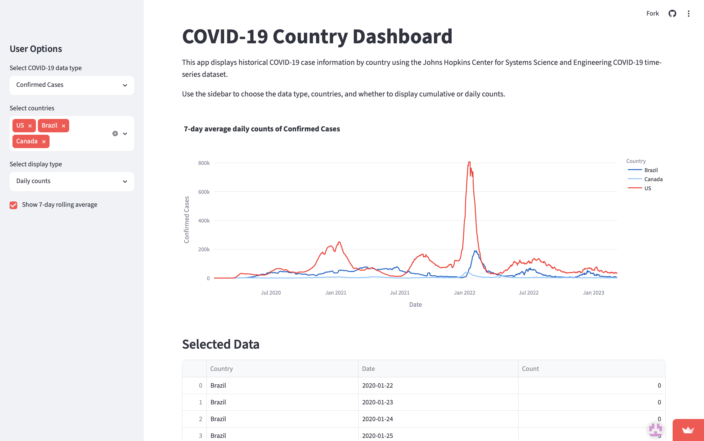

# Interactive COVID-19 Country Dashboard

An interactive dashboard for visualizing COVID-19 trends by country using the Johns Hopkins CSSE COVID-19 time-series dataset.



---

## Features

- Interactive country selection
- Cumulative confirmed cases
- Cumulative deaths
- Daily new confirmed cases
- 7-day rolling average
- Interactive Plotly visualizations
- Streamlit web interface

---

## Dataset

This project uses the Johns Hopkins CSSE COVID-19 Time Series dataset.

The raw data contains cumulative confirmed cases and deaths for countries and regions worldwide.

---

## Technologies

- Python
- pandas
- NumPy
- Plotly
- Streamlit

---

## Data Processing

The project performs several preprocessing steps:

- Cleaning raw time-series data
- Aggregating province-level records into country-level statistics
- Transforming wide-format data into long format
- Computing daily new cases
- Computing 7-day rolling averages

---

## Project Structure

```
Interactive-COVID-19-Dashboard
│
├── app.py
├── requirements.txt
├── README.md
├── data/
└── images/
```

---

## Installation

Clone the repository

```bash
git clone https://github.com/RaychieZ/Interactive-COVID-19-Dashboard.git
```

Install dependencies

```bash
pip install -r requirements.txt
```

Run the dashboard

```bash
streamlit run app.py
```

---

## Results

The dashboard allows users to

- compare multiple countries
- explore historical trends
- visualize daily new cases
- observe smoothed trends using rolling averages

---

## Future Improvements

- Vaccination statistics
- Geographic visualization
- More interactive filtering
- Forecasting models
